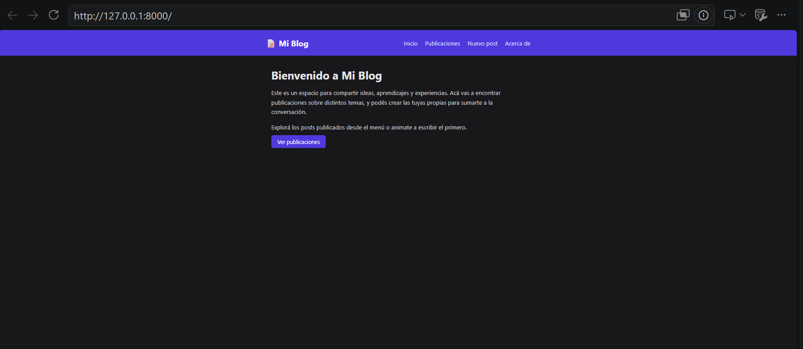
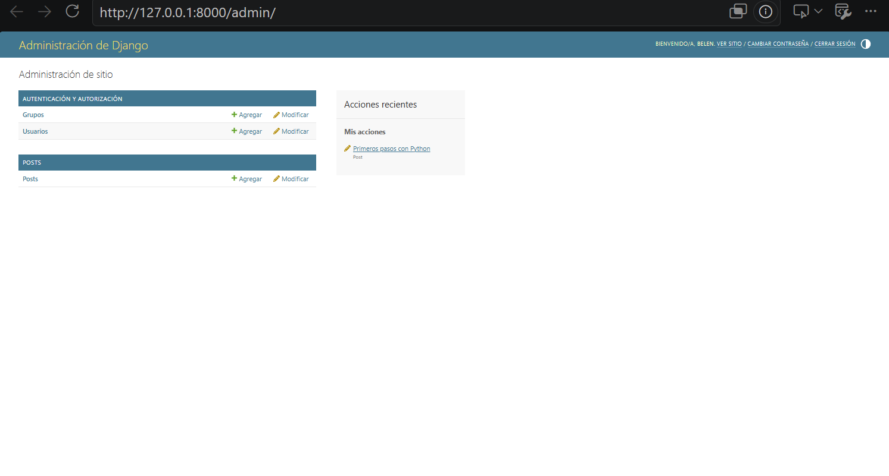

# Blog Django

Proyecto base de un blog web desarrollado con Django.

## Descripción

Este repositorio contiene la estructura inicial de un proyecto Django para construir un blog.
Incluye la configuración base del proyecto (`blog_project`) y una aplicación llamada `posts`.

Configuración regional:

- Idioma: `es-ar`
- Zona horaria: `America/Argentina/Buenos_Aires`

## Requisitos

- Python 3.12 o superior
- Git

## Instalación

Clonar el repositorio:

```bash
git clone https://github.com/Belen2511/Proyecto-Blog_Django.git
```

Entrar a la carpeta del proyecto:

```bash
cd Proyecto-Blog_Django
```

Crear el entorno virtual:

```bash
python -m venv venv
```

Activar el entorno virtual:

En Windows PowerShell:

```bash
.\venv\Scripts\Activate.ps1
```

En Linux o macOS:

```bash
source venv/bin/activate
```

Instalar las dependencias:

```bash
pip install -r requirements.txt
```

Crear la base de datos (aplica las migraciones del modelo `Post`):

```bash
python manage.py migrate
```

La base de datos (`db.sqlite3`) no se sube al repositorio, así que este paso
es necesario la primera vez. Después hay que cargar los posts desde el admin
(ver [Cargar contenido desde el admin](#cargar-contenido-desde-el-admin)).

## Ejecutar el servidor

```bash
python manage.py runserver
```

Abrir en el navegador:

```
http://127.0.0.1:8000/
```

Páginas disponibles:

| Ruta | Descripción |
|------|-------------|
| `/` | Página de inicio |
| `/acerca/` | Acerca de (autor y propósito del sitio) |
| `/posts/` | Listado de publicaciones publicadas |
| `/post/<id>/` | Detalle de una publicación |
| `/nuevo/` | Crear una publicación |
| `/admin/` | Panel de administración |

Para detener el servidor: `Ctrl + C`.

## Capturas

Página de inicio (`/`):



Panel de administración de Django (`/admin/`), con el modelo `Post` registrado:



## Estructura

```
blog_django/
│
├── manage.py
├── README.md
├── requirements.txt
│
├── blog_project/
│   ├── settings.py
│   └── urls.py
│
└── posts/
    ├── admin.py
    ├── apps.py
    ├── forms.py
    ├── models.py
    ├── urls.py
    ├── views.py
    │
    ├── templates/
    │   └── posts/
    │       ├── base.html
    │       ├── inicio.html
    │       ├── lista_posts.html
    │       ├── detalle.html
    │       ├── nuevo.html
    │       └── acerca.html
    │
    └── static/
        └── posts/
            └── css/
                └── estilos.css
```

## Modelo Post

Cada publicación tiene `titulo`, `contenido`, `autor`, `likes`, `fecha_creacion`
y `estado`. El estado puede ser:

| Valor | Se muestra como |
|-------|-----------------|
| `borrador` | Borrador |
| `publicado` | Publicado |
| `archivado` | Archivado |

## Cargar contenido desde el admin

Crear un superusuario (la primera vez):

```bash
python manage.py createsuperuser
```

Iniciar el servidor e ingresar a:

```
http://127.0.0.1:8000/admin/
```

Desde la sección **Posts** se pueden crear, editar y borrar publicaciones.
Conviene cargar al menos 3 posts con distintos datos y estados para probar el listado.

## Consultar posts con el ORM

La view `lista_posts` (en `posts/views.py`) trae desde la base de datos solo los
posts publicados, del más reciente al más antiguo, y los envía al template
mediante el contexto:

```python
def lista_posts(request):
    posts = Post.objects.filter(estado="publicado").order_by("-fecha_creacion")
    promedio = posts.aggregate(promedio=Avg("likes"))["promedio"] or 0
    mas_popular = posts.order_by("-likes").first()
    context = {
        "posts": posts,
        "promedio": round(promedio, 1),
        "mas_popular": mas_popular,
    }
    return render(request, "posts/lista_posts.html", context)
```

Los posts en estado borrador o archivado no aparecen en `/posts/`.

## Templates y estilos

Todas las páginas extienden de `posts/base.html` con ``
y rellenan el bloque ``. El CSS se carga desde
`posts/static/posts/css/estilos.css` con ``.

En `posts/templates/posts/lista_posts.html` se recorren las publicaciones con un
bucle `` y se muestra de cada una el título, el contenido,
el autor, el estado, la fecha de creación y los likes:

```html

<a class="card" href="">
    <h2>{{ post.titulo }}</h2>
    <p>{{ post.contenido|linebreaksbr }}</p>
    <div class="meta">
        por {{ post.autor }} — {{ post.get_estado_display }} — {{ post.fecha_creacion|date:"d/m/Y H:i" }} — {{ post.likes }} likes
    </div>
</a>

<p class="stats">Todavía no hay posts.</p>

```

## Checkpoint: Modelos y Admin configurados

Commit de este checkpoint: `Checkpoint: Modelos y Admin configurados.`

En este punto del proyecto quedó listo:

- El modelo `Post` (`titulo`, `contenido`, `autor`, `likes`, `fecha_creacion`, `estado`) definido en `posts/models.py`, con sus migraciones aplicadas.
- El modelo `Post` registrado en el panel de administración (`posts/admin.py`), desde donde se pueden crear, editar y borrar publicaciones (ver la captura del admin en la sección [Capturas](#capturas)).

## Aplicaciones

- `posts`: aplicación inicial para manejar las publicaciones del blog.
